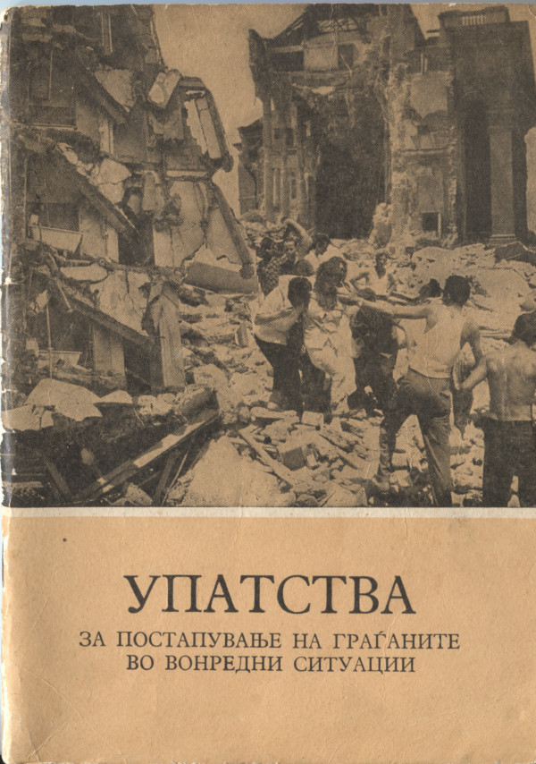

# УПАТСТВА ЗА ПОСТАПУВАЊЕ НА ГРАЃАНИТЕ ВО ВОНРЕДНИ СИТУАЦИИ

СОЦИЈАЛИСТИЧКА РЕПУБЛИКА МАКЕДОНИЈА\
Републички секретаријат за народна одбрана

скопје ⁠–⁠ 1968 год.

---

ЦЕЛТА НА ИЗДАВАЊЕТО НА ОВИЕ УПАТСТВА Е ДА ИМ СЕ ДАДАТ НА ГРАЃАНИТЕ ОСНОВНИ СОЗНАНИЈА ЗА ОПАСНОСТИТЕ ШТО ГО ЗАГРОЗУВААТ СОВРЕМЕНОТО ОПШТЕСТВО И ДА СЕ УКАЖЕ НА НАЈВАЖНИТЕ ОБВРСКИ, МЕРКИ И ПОСТАПКИ ШТО ГРАЃАНИТЕ ТРЕБА ДА ГИ СПРОВЕДУВААТ ПРИ ЕЛЕМЕНТАРНИ НЕСРЕЌИ И ВОЕНИ ДЕЈСТВА, ЗА ДА СЕ НАМАЛАТ ЖРТВИТЕ И ДРУГИТЕ ПОСЛЕДИЦИ ШТО ГИ ПРИЧИНУВААТ ОВИЕ ОПАСНОСТИ.

---

*ГРАЃАНИ,*

*Времето во кое живееме е полно со изненадувања и опасности што постојано го следат и загрозуваат човекот и неговата егзистенција. Разните елементарни и други несреќи, кои можат да бидат предизвикани од природните стихии, современиот начин и услови за живеење или како последица на воени судири, доведуваат до масовни несреќи, кои нанесуваат голежи човечки и материјални загуби.*

*Географската положба, геолошкиот состав и хидрометеоролошките услови на СР Македонија, се мошне честа причина за разни елементарни несреќи — земјотреси со поголем интензитет, лизгање и уривање на земја, поплави, силни ветрови и сл. Подрачјето на СР Македонија е особено подложно на чести земјотреси. Постојаниот развој на сообраќајот е честа причина за голени сообраќајни несреќи. Се поголемата концентрација на леснозапални и ексеплозивни материи во населбите упатуваат на перманентно присутна опасност од пожари и експлозии, а честите воени судири во разни подрачја на светот, укажуваат и на потенцијалната опасност од војна.*

*Во вонредните услови што ги предизвикуваат овие опасности, последиците, особено жртвите можат да бидат значително намалени со добра организираност, обученост и познавање на обврските, мерките и постапките што во такви услови треба да ги извршува секој граѓанин одделно. Затоа, ваше траво и должност е да се запознаете со распоредот, задачите и постапката во разни услови.*

*Во случај на војна и посебно при евентуална употреба на современите оружја за масовно уништување, може успешно да се спротивстави сако оној што ќе го познава дејството на тоа оружје, мерките и постапките за заштита и ако организирано се подготвува за тоа. Секој граѓанин, каде и да е, коже да биде изложен на радиоактивно дејство и последиците од него, на изгоретини, физички и психички трауми, заразни и други болести.*

> **Обученоста, добрата организираност и дисциплинираноста во извршувањето на задачите се основен услов за намалување и брзо отстранување на последиците.**

### **НАУЧЕТЕ СЕ!**

КАКО СЕ ОДБЕГНУВААТ, НАМАЛУВААТ И ОТСТРАНУВААТ МОЖНИТЕ ОПАСНОСТИ И ПОСЛЕДИЦИ ОД НЕПРИЈАТЕЛСКИ ДЕЈСТВА, ЕЛЕМЕНТАРНИ И ДРУГИ НЕСРЕЌИ.

Органите за народна одбрана, во соработка и со помош на органите на работничкото самоуправување во работните организации, органите на самоуправувањето во општините и месните заедници, општествено-политичките, Црвениот крст и другите организации, организираат курсеви за укажување на прва медицинска помош, за нуклеарно-биолошка и хемиска заштита, за спасување, за градежно-техничка заштита, за самозаштита, како и за специјални единици за одбрана и заштита.

Настојувајте да завршите еден од овие курсеви! Додека не бидете опфатени со некој од нив, овој прирачник ќе ви даде некои основни, но и мошне полезни совети во врска со начинот на спроведувањето на мерките за самозаштита и постапувањето во определени ситуации: на знак за узбуна, престанок на узбуната, при засолнување, евакуација, затемнување, како со мерките и постапката за отстранување на последиците од пожари, земјотреси, поплави, нуклеарни и други напади.

### ЗНАЕТЕ ЛИ КАДЕ СТЕ РАСПОРЕДЕНИ?

Според Законот за народна одбрана можете да бидете распоредени во единиците на ЈНА и цивилната заштита (како воен обврзник) и во работната или друга организација (како обврзник на работна обврска).

> **Одбраната на земјата е највисока должност и чест на секој граѓанин... (од Уставот на СФРЈ)**

1. Ако сте распоредени во ЈНА, тоа треба да го знаете однапред. По огласувањето на мобилизацијата, веднаш јавете се на определеното место во вашиот распоред.

**Запомнете**, во првите часови од војната вашето присуство е најнеопходно за Армијата. Вашиот воен распоред важи како воена карта.

> **Со совесно и дисциплинирано извршување на обврските кон народната одбрана во мир и војна обезбедуваме посигурна одбрана на нашата земја.**

2. Распоредот во единиците на цивилната заштита и зборните места треба да се знаат напамет.

    Во сите настанати вонредни услови (големи елементарни несреќи или непријателски дејства), не чекајте да бидете повикани, веднаш јавете се на определеното зборно место. Животот на повредените или затрупаните сограѓани е можеби во опасност и само со брза и ефикасна интервенција на вашата единица може да се спаси.

3. Ако сте распоредени во некоја единица за самозаштита во работната организација, месната заедница или во станбената зграда, запознајте се подробно со задачите што ќе треба да ги извршувате во случај на војна или поголеми елементарни несреќи. Ваша обврска е веднаш и со сите свои сили да се вклучите, во брзото спасување на постраданите сограѓани, имотот и материјалните средства.

4. Ако сте распоредени во работната организација, покрај задачите на работното место, запознајте се со постапката и мерките за заштита во таа работна организација. Во случај на ненадеен напад или поголема елементарна несреќа, не чекајте да бидете повикани, веднаш јавете се во работната организација.

5. Во случај на мобилизација или ненадеен напад, ако немате распоред, вашето зборно место е во месната организација на самозаштитата. Потребните известувања за понатамошната постапка ќе ги добиете преку раководството на оваа организација.

> **Во вонредни услови (војна или елементарни несреќи) ставете се во служба на народот и настојувајте сите ваши способности максимално да се искористат.**

Сите податоци и известувања од интерес за одбраната на земјата, до кои ќе дојдете при извршувањето на обврските кон народната одбрана или на некој друг начин, должни сте да ги чувате како државна тајна.

### **САМОЗАШТИТА**

Самозаштитата е систем на мерки, постапки и форми на организирање на граѓаните низ кои секој граѓанин на определен начин придонесува за подобрување на условите на сопствената заштита и заштитата на земјата воопшто, односно го спојува интересот за сопствената безбедност со безбедноста на земјата.

Ако не сте распоредени во единиците на ЈНА, во специјализираните и други единици на народната одбрана и цивилната заштита или во работната организација, вклучете се во некоја од единиците за самозаштита на своето подрачје.

За организирањето на единици и подготовката на граѓаните за самозаштита одговорни се:

- куќните совети,
- советите на месните заедници,
- раководните органи во работните и други организа- ции и органите на управата на општинското собрание.

Со учеството во единиците и преку курсевите за самозаштита ќе се оспособите за самопомош и заемна помош во: спасување од урнатини, укажување прва медицинска помош на повредените, прва помош на контаминираните граѓани со РБХ агенси, попречување и гаснење на пожари и др.

> **Не жалете го трудот и времето за ваквите активности, зашто тоа е во ваш истерес и во интерес на вашето семејство.**

Секое семејство, а за заедничките станбени згради, надлежните работни организации за стопанисување со нив и други сопственици на станбени и други објекти, треба да ги обезбедат следните средства за заштита.

Тие средства се неопходни за вашата заштита. Некои од нив можат и сега да се употребуваат, затоа направете план за нивната набавка. Обрнете внимание на тоа тие секогаш да бидат во исправна состојба за да можат да се употребат во вонредни услови.

> **Парите што ќе ги потрошите за обезбедување на средства за лична и колективна заштита не се нерентабилни, тие во вонредни услови ќе придонесат да го заштитите животот и имотот.**

Пожелно е, секој член на семејството да ја познава својата крвна група, бројот на заштитната маска, на облеката и чевлите, потем, адресите на другите членови на семејството и блиските соседи и роднини, броевите на најважните телефони и др.

СЛИКА ОВДЕ\
Поделба на крвните групи

Податоците за крвната група внесете ги во здравствените книшки на членовите од вашето семејство, а картонот што ќе го добиете од Заводот за трансфузија носете го со себе. Познавањето на крвната група е од големо значење во вонредни услови. Крвната група ја утврдува Заводот на ваше барање.

> **Животот на повредените често пати зависи од трансфузијата на крв. Крв може да даде секој здрав човек без штета за своето здравје, затоа станете и вие доброволен дарител на крв.**

### КОИ СЕ ОСНОВНИТЕ МЕРКИ, ПОСТАПКИ И СРЕДСТВА ЗА ЗАШТИТА, ШТО ТРЕБА ДА ГИ ЗНАЕТЕ?

Не правете, туку спречувајте ги појавите на секаква паника.

1. За секоја евентуална опасност од непријателски дејства, или елементарни несреќи, како и за отстранувањето на опасноста, ќе бидете известени:

    а) За непосредно претстојна опасност од непријателски воздушни и други дејства, ќе бидете известени со ЗАВИВАЊЕ на сирени (забрзано ѕвонење на камбани, звона, други звучни средства) во траење од една минута.

    Знак за воздушна опасност.

    една минута подигање и спуштање на тоновите.

    СЛИКА ОВДЕ\
    Средства за узбунување

    б) За непосредна опасност од елементарни несреќи, ќе бидете известени преку свирење на сирените со три рамномерни (сигнали) од по 20 секунди и 2 паузи помеѓу сигналите од по 20 секунди во вкупно траење од 100 секунди —

    |20 сек.|20 сек.|20 сек.|20 сек.|20 сек.|
    |-|-|-|-|-|
    |(свирење)|(пауза)|(свирење)|(пауза)|(свирење)|

    в) Ако непосредната опасност е отстранета ќе бидете известени со еднолично (рамномерно) свирење на сирените во траење од една минута.

    една минута\
    (продолжително-равномерно свирење)

    Знак —⁠ опасноста е отстранета —

2. Работните и други организации, како и населби во кои не се слушаат звучните сигнали на определените средства за узбуна, ќе определат посебни ⁠–⁠ дополнителни средства за узбуна (известување). Затоа, запознајте се со сред свата и знаците за узбуна во вашата работна организација, населба, зграда и др.

Ако при пробите на средствата за узбуна утврдите дека сигналите за узбуна не се слушаат добро во вашиот стан или на работното место, известете го за тоа надлежниот орган за народна одбрана од вашето подрачје, односно раководството на вашата работна организација.

### **КАКО ТРЕБА ДА ПОСТАПУВАТЕ НА ЗНАКОТ ЗА ВОЗДУШНА УЗБУНА**

Не заборавете дека во случај на непосредна опасност од војна или по отпочнувањето на војната, секој момент може да настапи опасност од воздушни или други непријателски дејства. Затоа, бидете готови навреме да се засолните, но пред да се засолните извршете ги и овие работи:

- исклучете ги сите инсталации во куќата ⁠–⁠ станот (водоводна, електрична, термичка);
- изгаснете го осветлението во станот и отворете ги прозорците, а ролетните, капаците и сл. затворете ги;
- отстранете ги од станот сите леснозапални материјали;
- покријте ги сите хранителни продукти и садови со вода;
- со себе земете ја заштитната маска (ако ја имате), парите и други документи од вредност и средства за лична употреба;
- земете сува храна и вода најмалку за еден ден;
- со себе земете ги средствата за прва помош и транзистор;

По извршувањето на овие задачи, веднаш и без паника појдете во најблиската скривница.

Ако не можете навреме да стигнете до скривницата, легнете до некој цврст и тежок ѕид, предмет, ров или дупка што ќе може да ви овозможи поголема заштита. Заштитете ја голата кожа (на лицето, рацете, нозете) со делови од облека и свртете го лицето кон подот.

> **Не заборавете дека е забрането да се носат предмети што ќе заземаат многу место, потем, леснозапални, експлозивни и други штетни материјали.**

При заминување во скривницата помогнете им на оние кои имаат потреба од помош.

Запознајте се со содржината на наредбата за редот и однесувањето во скривницата. При доаѓање или напуштање на скривницата, јавете се на раководителот.

> **Запознајте ги членовите на вашето семејство со знаците за узбуна и постапката.**

СЛИКА ОВДЕ\
Одење во скривница

#### НА РАБОТНОТО МЕСТО:

Итно и без паника засолнете се во скривницата или во друго место што е определено за вас, според планот за заштита.

До колку процесот на производството не позволува оддалечување од работното место, постапувајте според упатствата што во врска со тоа ќе ви ги дадат надлежните во вашата работна организација.

Должни сте подробно да се запознаете со задачите, мерките за заштита и постапката во работната организација во случај на узбуна.

СЛИКА ОВДЕ

#### ВО УЧИЛИШТЕТО:

Учениците ќе бидат навреме евакуирани во помалку загрозени населби, но и покрај тоа, наставничкиот и другиот персонал должни се да ги преземат сите потребни мерки за разработување и запознавање на учениците **со постапката во случај на ненадеен напад**. Тие се должни и одговорни за заштитата на своите ученици и ќе преземат сѐ што е потребно навреме и без паника да ги засолнат учениците во најблиските скривници-ровови, тунели и други погодни места за засолнување.

> **Наставници и воспитувачи, подготвувајте се, во случај на потреба да ги заштитите своите учени- ци и себеси.**

#### НА ЈАВНО МЕСТО:

Ако знакот за узбуна ве затекне на улица, во продавница, на предавање, состанок, кино, театар, ресторан и други јавни места, најбрзо и без паника напуштете го тоа место и побарајте засолниште во најблиската скривница или други места што можат да ви обезбедат поповолна заштита.

Ако узбуната ве затекне на железничка или автобуска станица, потем во воз, автобус и во други јавни сообраќајни средства, постапувајте според упатствата што ќе ви ги дава персоналот на сообраќајот или органите за контрола на сообраќајот.

Возачи на моторни и други возила, запрете го возилото и засолнете го во помалку прометна улица, а вие засолнете се во најблиската скривница или друго погодно место. Внимавајте на отстојанието на возилата.

При ноќно возење сите светла на возилата треба да ги засените според наредбата за затемнување, а во узбуна изгаснете ги наполно.

Сопственици на запрежни возила, веднаш отпрегнете го добитокот и врзете го за некое дрво, за да не се исплаши и да не побегне, зашто може да предизвика безредие и паника.

### ПОСТАПКА НА ЗНАКОТ-ОПАСНОСТ ОД ЕЛЕМЕНТАРНИ НЕСРЕЌИ

Ваков знак за узбуна ќе се дава само во случај на опасност од поплави, пожари и други елементарни несреќи од големи размери.

#### ВО СЛУЧАЈ НА ПОПЛАВИ

Веднаш јавете се на определеното зборно место на вашата единица (ако сте распоредени во таква единица).

Преземете ги сите неопходни мерки за да се спречи навлегувањето на водата во подрумските, станбените, работните и други простории.

Ако немате време и услови да преземете други мерки, сите подвижни предмети што можат да претрпат оштетување, пренесете ги на погорните катови од зградата.

Настојувајте навреме да ја напуштите зградата, што според вашите размислувања и проценка може да биде изложена на главниот налет на водата.

Размислите со кои прирачни средства можете да си помогнете во такви случаи (корита, кади, јажиња, летви и др.).

Помогнете им на болните, на старите и на децата да ја избегнат опасноста. **Запомнете!** Водата, од бунари, од чешми или од водоводот на поплавеното подрачје не смее да се употребува за пиење се додека тоа не се одобри од надлежната здравствена служба.

Учествувајте во отстранување на последиците што ќе настапат од поплавата и постапувајте според упатствата и наредбите на надлежниот орган.

Ако сте во работен однос, должни сте веднаш да се јавите во својата работна организација и да постапувате според упатствата од надлежните фактори во работната организација.

#### ВО СЛУЧАЈ НА ПОЖАРНА ОПАСНОСТ

Ставете се на располагање на противпожарната единица што е ангажирана во гаснењето на пожарот и постапувајте според нејзините упатства, зашто само со единствена тактика и организација можат да се спасат загрозените луѓе и средства, да се локализира и да се изгасне пожарот.

> **Поединечните и неусогласени акции можат само да пречат.**

Навреме излезете од објектот што може да биде зафатен од пожарот и не создавајте услови за ангажирање на луѓе и средства околу вашето спасување.

При напуштањето на загрозените објекти земете ги со себе парите, документите од вредност, храна и облека, онолку, колку што ќе можете да носите.

#### ПОСТАПКА ПО ОБЈАВУВАЊЕТО ⁠–⁠ ПРЕСТАНОКОТ НА УЗБУНАТА

Кога ќе се даде знак дека непосредната опасност е отстранета, постапувајте според следното:

> **Одбегнувајте ја употребата на телефони и на патнички возила без итна потреба бидејќи со тоа им пречите во работата на службите за спасување.**

### ЗАСОЛНУВАЊЕ

1. Дали знаете каде има јавни или други скривници и што треба да сторите за да обезбедите услови за засолнување (дома, на работното и на јавни места).

Знајте дека времето за засолнување е кусо. Затоа, ако се најдете надвор од својот стан или работната организација, размислете во која најблиска скривница ќе се засолните во случај на воздушна опасност.

Со наредбата за постапката на знаците за узбуна ќе се даде преглед на скривниците и на нивните корисници по месните заедници.

Приберете ги сите податоци што се од интерес за вас и вашето семејство.

**Прибележете ги овие податоци за скривниците во вашето место, зашто можат да ви затребаат:** ул. и бр., каде се каоѓа скривницата, дали е за општа употреба (јавна) или кукна, за колку време можете да стигнете и каде се наоѓа влезот?

Ако локацијата на овие скривници не ви одговара поради нивната оддалеченост, консултирајте го надлежниот орган за комунални работи, дали можете за вашето семејство да изградите скривница во куќата или во нејзината близина и како?

СЛИКА ОВДЕ\
Скица на рововска скривница

СЛИКА ОВДЕ\
Покриени рововски скривници

За засолнување можат да се користат и: рударски и други јами, отворени и покриени рововски скривници, поткопи, земјанки и др.

**Рововски скривници** можете и сами да ископате во своите дворови и насекаде каде што ќе живеете и работите и каде што има за тоа услови.

Не се препорачува засолнување во: котларници, перални, во близина на цистерни и складишта со леснозапални и експлозивни или хемиски материјали, како и во поголеми водоводни и канализациони инсталации.

За изградбата, одржувањето, редот и начинот на користењето на скривниците за општа употреба, одговорен е определениот орган од општината, за куќните (подрумски или рововски) одговорни се куќните совети и соодветните претпријатија за комунално стопанисување, а за скривниците во работните организации, нивните раководни органи.

**Постапка во скривниците.** Одговорните органи и организации за одржувањето и употребата на скривниците го утврдуваат редот, начинот на користењето и однесувањето во скривниците. За таа цел, тие определуваат екипи што ќе се грижат за редот и однесувањето во нив.

Помеѓу друго, екипите се должни откако ќе се наполни скривницата, сите новопристигнати да ги информира каде се наоѓа другата најблиска скривница, како и да се грижат за светлосните, вентилационите и другите уреди и средства кои се нужни за обезбедување приближно погодни услови за престојување во скривницата.

СЛИКА ОВДЕ\
Покриена и откриена рововска скривница

По објавениот престанок на опасноста, раководителот на екипата ги известува граѓаните за евентуалните опасности на кои тие можат да бидат изложени и мерките на претпазливост што треба да се преземаат по напуштањето на скривницата. Ако реонот на скривницата е контаминиран, не треба да излегувате додека опасноста не се отстрани.

Главниот и резервниот излез можат да бидат затрупани, затоа во секоја скривница покрај друга опрема, треба да има и алат за расчистување.

Должни сте да ги исполнувате наредбите и упатствата на раководителот на скривницата.

СЛИКА ОВДЕ\
Најнужна опрема за скривница

### ЗАТЕМНУВАЊЕ

Придржувајте се по упатствата од наредбата за затемнување. Запознајте се со начинот на спроведувањето на оваа мерка и подгответе ги сите нужни средства за таа цел.

На знак за узбуна изгаснете ги сите светла (извршете потполно затемнување)!

#### ЗАТЕМНУВАЊЕ НА ЗГРАДА

Потполно затемнување се врши со гаснење на секоја сијалица одделно или со гаснење на осветлението преку разводната табла.

Во сите други случаи осветлението се намалува со затемнување на сијалиците и надворешните светлосни отвори. Ова се врши со поставување навлаки-завеси или со бојадисување на сијалиците и прозорците за да не се гледа светлината однадвор. Навлаките на сијалицата треба да бидат од темна ткаенина или хартија, а за бојадисување може да се употреби само темносина и црна боја. Не се бојадисува само долниот дел на сијалицата што е свртен спрема подот. Вакво затемнување се врши во ходниците, во скалите и во други слични простории каде што не е потребна посилна светлина.

Прозорците и другите светлосни отвори исто така треба да ги затемнувате со разни темни материјали: ќебиња, хартија и др. Сите стаклени површини можат да се бојадисуваат со темносина и црна боја.

СЛИКА ОВДЕ\
Начин на затемнување

##### Затемнување на јавни локали

Сите јавни локали мора да бидат затемнети однадвор. За ориентација во излозите може да се остави осветлен натпиc, кој исто така треба да биде затемнет со хоризонтален штит.

Сите надворешни врати треба да имаат затемнет дел (темна комора) така што светлината при отворањето на вратата да не се гледа однадвор.

##### На улица

Не употребувајте ќибрит, запалки, ламби, свеќи, фенери и други средства за осветлување. Фенерите и фаровите на сообраќајните возила мораат да бидат затемнети.

Големите светла на автомобилите мораат да бидат бојадисани или покриени со навлака од темен материјал, оставајќи отвори во должина од 10 см. и ширина 1 см., а од горната страна треба да се постави штит под агол од 45°.

И задните светла треба да бидат затемнети така што да не се гледаат на оддалеченост од 10 ⁠–⁠ 15 метри.

На знакот „воздушна узбуна“ сите светла моја да се изгаснат, освен оние што го означуваат влезот на скривниците, кои мора да бидат на соодветен начин затемнети.

Одговорни за правилното спроведување на оваа мерка се: куќните совети, сопствениците на зградите и возилата, раководителите на јавните локали и други работни организации.

Контролата во спроведувањето на затемнувањето ја вршат органите на милицијата и единиците на цивилната заштита.

Запознајте се со наредбата за затемнување!

### ЕВАКУАЦИЈА

Eвакуацијата е една од основните мерки за заштитата на населението во случај на војна и други големи несреќи.

Целта на евакуацијата е да се намали бројот на населението во најзагрозените населби и со тоа да се намалат и можните последици врз луѓето (бројот на жртвите и повредените). Таа се извршува по однапред изготвени планови. Евакуацијата мора да се врши брзо и дисциплинирано.

Евакуацијата ќе се врши само по издадена наредба за тоа. Таква наредба може да се издаде пред да настапи непосредна опасност (нападот, елементарната несреќа) или по тоа.

Со наредбата се утврдува кој треба да се евакуира, начинот и местото на евакуирањето и друго, но предимство имаат: мајките со мали деца, децата до 16 год., изнемоштените, болните и старците. Обрнете внимание на упатствата што во врска со тоа ќе ви ги даваат: штабовите за цивилна заштита, куќните совети и органите во работната организација, кои се одговорни за спроведување на евакуацијата.

Наредбата за евакуација може да биде објавена преку печатот, радиото, огласи, разгласни станици, мегафони и др. Постапувајте според наредбата. Секакво друго постапување е погрешно и забрането.

> **Помогнете им на надлежните органи, евакуацијата да се изврши организирано и без паника.**

Пред да го напуштите станот-куќата, како и при одење во скривница, треба да ги извршите и овие работи:

Затворете го станот-работната просторија и еден клуч предајте му на органот што е задолжен за одржување или обезбедување на објектот: на одговорното лице во куќниот совет, во работната организација, стражарската служба, ми- лиционерската станица или на други што ќе бидат опреде- лени за тоа.

Подгответе се за пат. Со себе земете ги сите работи што ќе ви бидат неопходни за живот во местото на евакуаци- јата, но немојте да носите повеќе отколку што би можеле да носите сами на оддалеченост до 30 км. Препорачливо е да носите резервна облека, чевли, Кебиња, прибор за јадење и лична хигиена, поважни документи, батериска ламба, кибрит, транзистор, гумен душек, шатор, сува храна за 1⁠–⁠2 дена, средства за лична заштита; завои и други средства за прва медицинска помош, заштитна маска, заштитна облека, гумени чизми и др.

Настојувајте дома секојпат да имате резерви на препечен леб и конзервирана храна што не се расипува брзо.

По доаѓањето на зборното место, веднаш јавете му се на штабот, или на друг одговорен орган што ја извршува евакуацијата и понудете му ја својата помош, ако сте оспособени да укажувате прва медицинска помош и сл.

Помогнете им на децата, на болните и на постарите навреме да отидат на зборното место, како и до местото што ќе им биде определено за сместување.\
СЛИКА ОВДЕ

> **Извршете ги своите обврски веднаш по доаѓањето на новото место за време на престојот.**

Пријавете му се на надлежниот орган во местото каде што ќе бидете сместени и извршувајте ги сите наредби на месните органи.

Во ваш интерес е да се грижите за личната и општата хигиена, бидејќи ваквите ненормални услови за живеење отвораат погодност за појавување и брзо пренесување на заразни заболувања.

По објавувањето на наредбата за итна евакуација, должни сте веднаш да излезете на определеното зборно место (собирен пункт).

Вие можете, ако условите позволуваат, самостојно да обезбедите сместување кај свои роднини и пријатели и надвор од определеното место. Но, за тоа треба да го известите надлежниот штаб — орган, како во местото од каде што се евакуирате, така и во местото на евакуацијата. Одржувајте добри и редовни односи со таквите свои пријатели и роднини и помагајте им ако е тоа во ваша можност.

Досега укажавме на некои мерки и постапки, кои ако ги применуваме правилно треба да придонесат за одбегнување и значително намалување на последиците, но еве и неколку совети за тоа, како треба да се постапува откако претпоставената опасност ќе настапи:

##### **Важни податоци за извршување на евакуацијата**

На кој собирен пункт (зборно место) треба да се јавите (вие или членовите на семејството);

- по кои улици и патишта ќе можете да се движите (зашто некои не ќе можат да се користат);
- местото каде што ќе се врши. прифат и разместу- вање на граѓаните што ќе се евакуираат.

Ако нападот не е извршен (нема разурнувања и други последици), продолжете да ја вршите својата редовна работа.

Во случај да настапиле носледици (разурнувања, пожари, контаминација и др.) веднаш нaјавете се во својата единица заради отстранување на последиците.

ПОЖАР

Мирно и без паника обидете се пожарот да го изгаснете.
Имајте ја на ум поговорката „дека во првата минута за тоа
е доволна само една чаша со вода, додека во третата може

ла биде недоволна и една цистерна“.

Не дозволувајте пожарот да се распламти, отстранете ги
брзо и навреме сите предмети и материјали што лесно се палат.
Внимавајте, вратите и прозорците треба веднаш да се затворат,
зашто продувот го поспешува горењето и брзото ширење на по-

жарот.

22

До колку пожарот е од поголеми размери не губете вре-
ме, туку ангажирајте ги сите способни членови на семеј-
ството, состанарите или единицата за самозаштита, во гас-
нењето на пожарот. Ако и овака не се локализира пожарот,
барајте интервенција од противпожарната единица (помош).

Уроверете го вашето знаење за ракувањето со
противиожарните, а особено со прирачните сред-
ства за гаснење на пожари.

Не бегајте од човек на
кој облеката му гори,
туку натерајте го да
легне и да се тркала
на подот од кај стра-
ната што е зафатена
со огнот: покријте го
со ќебе, со чаршав и сл.

И

Запален бензин, петрол, масло, маст и сл. не гаснете ги
со вода, туку со песок, пепел, влажни струготини и сл.

Електричната инсталација исто така не се гасне со вода.
Прво, извадете го осигурувачот, а потем, гаснете го пожа-
рот со сува или со влажна крпа, со песок, пепел, влажни
струготини и сл.

Остатоците од напалм бомби и други запални средства
најдобро и најбрзо се гаснат со песок.

Во просторијата каде што ќе се појави пожар влегу-
вајте наведнати и внимателно. За да не се затруете зашти-
тете ги органите за дишење со шамиче, со крпа и сл. кои
пред тоа треба да ги натопите со вода.

Пожарот секојпат се шири од подолните кон погорните
катови според движењето на воздухот при што високата
температура може да доведе до значителни промени врз
градежните елементи и до урнување.

26

Пред да излезете од запалената зграда ако имате време
и можност исклучете ги сите инсталации и исфрлете ги си-
те леснозанални предмети и материјали (бутан гас, нафта,
бензин и др.) што можат да придонесат за брзо ширење на
пожарот и предизвикување на други несреќи.

Спасување со помош на јаже

Употребата на лифт во такви услови не е сигурна, би-
дејќи со тоа може да се пренесе и пожарот.

Ако не можете да се користите со скалите спуштете се
со помош на јаже, чаршав и други прирачни средства кои
пред тоа треба добро да ги заврзете за некој погоден пред-

мет.
Помогнете му на соседот да го изгасне пожарот.

ЗЕМЈОТРЕС

За последиците од земјотресите секој знае, но малку
кој размислувал и знае што треба да стори во случај на
таква појава. Спонтаните и паничните постапки се најчести

ај

:
|

и мошне опасни, затоа, настојувајте и во такви случаи да
внесете повеќе организираност и колку што е можно пове-
ќе да ги контролирате своите постапки.

Стравот и емоциите најмалку можат да ви помогнат, за-
тоа решете се за брзо и енергично расудување и дејству-
вање.

Во таа насока ќе ви помогнат и следниве неколку
упатства:

Кога ќе го осетите првиот потрес заедно со семејството
побрзајте да го напуштите станот, но ако немате време за-
солнете се во рамката од вратата од главниот (носечкиот)

Засолнување во рамка од врата

зид или некој од внатрешните агли на собата, потем покрај
високи и масивни ормани, кои ќе можат да ги задржат
евентуалните урнатини или во најмалите простори и (МС,
купатила, тесни ходници и др.). Не губете време во обле-.
кување и барање на други предмети, алишта и сл.

Веднаш откако ќе престане првиот потрес најитно из-
лезете од зградата, зашто, обично брзо доаѓа до втор и по-
силен потрес, кој ги урива потешко напукнатите згради.

28

Настојувајте да бидете присебни и мирни зашто ва-
шето однесување може многу да влијае врз однесувањето
и постапките на семејството (средината).

Ако дојде до уривање и ако се најдете во облак од прав,
врзете си на устата газа или шамиче за заштита на орга-
ните за дишење.

По можност не спуштајте се со лифт и не задржувајте
се по скалите, ако имате јаже, подвижни скали и слично,
подобро е тоа да го сторите однадвор; не задржувајте се
во близина на згради што можат со своите урнатини да ве
загрозат; засолнете се на празен простор; одете по средина
на улиците и внимавајте на електричните и гасните инста-
лации во населбата.

По емирувањето на потресите, упатете го семејството
до местото определено за собиралиште на граѓаните што
ја одбегнале несреќата и настојувајте сите здрави и епо-
собни граѓани за работа веднаш да се вклучат во работата
на месните единици, односно во единиците за самозаштита
на работната организација (за спасување на затрупаните,
за укажување на прва медицинска помош, за гаснење на
појавените пожари и др.).

Ако сте затрупани обидете се да создадете повеќе про-
стор околу себе и ослободете ги органите за дишење; ба-
рајте помош, но не мрдајте, ако забележите дека со тоа мо-
жете уште повеќе да ја усложните вашата положба.

Ако знаете или ако се сомневате дека под урнатините
има затрупани луѓе, веднаш известете ги екипите за спасу-
вање каде тие се наоѓаат, од каде и како може полесно да
се дојде до нив. ;

Покажете им на екипите за спасување и расчистување,
каде се наоѓаат поважните уреди за електричната, гасната
и друга инсталација (шалттабли, шахти, вентили) и други
податоци што ќе им ја олесни и забрза работата околу спа-
сувањето.

Ако најдете труп, покријте го со чаршав, ќебе и сл., за
да се заштити од муви и известете ги веднаш единиците на
цивилна заштита.

Водата за пиење може да биде загадена, затоа не упо-
требувајте ја без одобрување на надлежната здравствена
служба, но ако е таа неопходна, тогаш употребувајте ја
само ако е преварена. Не влегувајте во оштетените згради
без одобрување на надлежниот орган.

Хо

ПОПЛАВА

Ако навреме го забележите Ннадоаѓањето на водата
што може да предизвика плавење и поголеми последици
или ако е даден знак за узбуна (во случај на поголема опас-
ност од поплавување) веднаш преземете ги следните мерки:

Се што може да се засолни од загрозеното место или
објект (покуќнина, живина, добиток и др.), засолнете го
навреме на простор или во објекти што не би можеле да
бидат загрозени со поплавата, но притоа не заборавете дека
и вие со семејството треба навреме да се засолните.

Пред напуштањето на зградата, исклучете ги сите ин-
сталации во куќата.

Ако немате доволно време и во случај да бидете из-
ненадени, исклучете ги инсталациите и отпочнете да пре-
несувате храна, облека и други потреби на погорните ка-
тови.

Пренесување храна, облека и др. на погорните катови
Откако ќе се засолните на посигурно место барајте по-

мошт (со викање или со други сигнални средства ⁠–⁠ ноќе
со светилки, дење со бело платно и др.).

30

ан баонетСац,

За време и по поплавата водата за пиење не употре-
бувајте ја без одобрување од соодветната здравствена
служба. Таа може да се употреби само ако е превриена. Ја-
вете се на здравствената служба за вакцинирање против
заразни болести и спроведувајте ги сите противепидемио-
лошки мерки.

ЗАШТИТА ОД НУКЛЕАРНОТО, ХЕМИСКОТО
И БИОЛОШКОТО ОРУЖЈЕ

ОД НУКЛЕАРНО

Нуклеарното (атомското) оружје е посебен вид на со-
времено оружје за масовно уништување на луѓето, матери-
јалните средства и за радиолошка контаминација (загаду-
вање).

Ова оружје се изразува низ три вида на дејствување:

Ударно, при кое создадениот од експлозијата возду-
шен бран предизвикува рушење на објектите.

Топлотно, од кое настануваат изгоретики кај луѓето
и опожарување на објектите и другите материјални сред-
ства; И

Радиоактивно, односно радиолошко зраче:е ⁠–⁠ кое со
своите штетни зраци доведува до смрт или ралшјациона
болест.

УДАРНО ДЕЈСТВО

Ударниот бран со својата голема разурнувачка сила
предизвикува тешки рушења и оштетувања на објектите,
масовни убивања, како и повреди на луѓето, што би биле
изложени на дејството на тој ударен бран, рушењето на
објектите, дробењето и расефрлувањето на разни матери-
јали и ел., а во зависност од оддалеченоста од центарот на
експлозијата.

31

|

ак

Степени на изгоретини

ТОПЛОТНО ДЕЈСТВО

Ова дејство се манифе-
стира, во вид на светло-
сен ефект (блесок), по-
четно топлотно зрачење
и дополнителни последи-
ци (ефекти).

Светлосниот блесок е
силен и краткотраен, но
кај незаштитените може
да предизвика ЕруВИи
мено слепило.

Почетното топлотно
дејство трае неколку се-
кунди и предизвикува
изгоретини на откриени-
те делови на телото, а
сите материи што горат
се запалуваат и предиз-
викуваат пожари.

Дополнителното топ-
толно дејство се мани-
фестира преку предиз-
викување голем број на
пожари чии размери во
голема мера ќе зависат
од оддалеченоста од цен-
тарот на експлозијата,
како и од карактерот на
теренот и објектите на
него. Овие пожари со ни-
што не се разликуваат
од тие што настануваат
од класичните запални
средства.

На летна
облека

На зимска
облека

Учиноци на почетното топлотно зрачење при воздушна експлозија
на разни материи

РАДИОАКТИВНО ДЕЈСТВО

Радиоактивното зрачење е посебна специфичност на
дејството на нуклеарното оружје ⁠–⁠ и тоа исто така има
почетно и дополнително дејство.

Почетното радиоактивно дејство (озрачување) се
јавува во моментот на нуклеарната експлозија, во реонот
околу центарот на експлозијата, трае околу 1 минута и
штетно дејствува врз незаштитените луѓе предизвикувај-
Ки тешки заболувања, дури и смрт.

Дополнителното радиоактивно зрачење се изразува во
вид на индуцирана (пренесена) радиоактивност на предме-
тите и материјалите, особено преку таканаречените радио-
активни врнежи, кои можат да предизвикаат загадување
(контаминација) на многу големо подрачје.

33

ОД ХЕМИСКО

Хемиско оружје или хемиски борбени средства се от-
ровни хемиски материи кои се употребуваат во цврста,
течна или гасна состојба. Тие се познати и под името бојни
отрови. Со своето разновидно големо отровно дејство, при

Ка

ЊЕ ро а
4 пати поголема изложеност

,

Изложеност на радиоактивно дејство

директен допир или преку контаминираниот (затрованиот)
воздух, земјиштето и материјалните средства, можат да
предизвикаат масовно уништување на луѓето и другите жи-
ви суштества, а храната, водата и другите материјални
средства, да ги направат за кратко или за подолго време

неупотребливи и со тоа да ја загрозуваат безбедноста на
граѓаните.

34

Почетно радиозктивно дејство

Радиоактивни врнежи

КАКО ДА СЕ ПО-
СТАПУВА ВО СЛУ-
ЧАЈ НА НАПАД
СО НУКЛЕАРНИ
И ХЕМИСКИ БОР-
БЕНИ СРЕДСТВА

Ако се наоѓате во
станот, (не сте се
засолниле навреме),
во моментот кога ќе
видите дека е фр-
лена бомба, а нај-
доцна веднаш со по-
јавата на светлос-
ниот блесок на а-
томската екеплози-
ја, легнете покрај
надворешниот зид,
под прозорецот, или
зад некој друг пред-
мет што ќе ве за-
штити.

Заштитете ги от-
криените делови на
телото, особено, ли-
цето и рацете, со
сопствената облека
или со некој друг
материјал што ќе се
најде во ваша бли-
зина. Во таква по-

ложба останете околу една до три минути. Ако ви е запа-
лена облеката тркалајте се по подот додека не се изгасне, а
потем, откако ќе помине првата опасност укажете си само-
помош и пристапете со укажување помош на другите.
Локализирајте ги и изгаснете ги запалените завеси и
предмети во куката, исклучете ги инсталациите и по тоа по-
барајте посигурна заштита (во подрумска, во рововска или
во некоја јавна скривница) зашто дејството не е преста-

нато.

35:

36

Ви

простор при атомска експлозија

Ако се наоѓате на јавно место. Веднаш легнете и по-
кријте ги откриените делови на телото, затворете ги очи-
те, а рацете ставете ги под облеката. Во таква положба ос-
танете околу 1⁠–⁠8 минути.

Со засолнување или залегнување во длабнатини, дуп-
ки, ровови, трапови, тунели и др. степенот и можностите
за заштита значително се зголемуваат.

Бидете внимателни, набргу по експлозијата отпочну-
ваат да паѓаат од создадениот радиоактивен облак радио-
активна прашина, земја и друг материјал што бил кренат
од земјата.

Заштита на органите за дишење со прирачни средства

Поради тоа, најнапред заштитете ги органите за дише-
ње (носот и устата) со шамиче, крпа, шал и др. делови од
облеката.

Повредените делови на телото треба веднаш да ги за-
штитете со преврска за да се попречи навлегувањето на
радиоактивни честички во организмот.

ОД БИОЛОШКО

Биолошко оружје е мошне опасно средство за масовно
уништување. Тоа се разни причинители на заразни заболу-
вања, кои предизвикуваат уништување или онеспособува-
ње на луѓето, животните и растителните култури.

За

нета аа анацАааа

Тие во војна можат да бидат употребени на разни на-
чини (со помош на авиони, артилерија, диверзија и ел), а
се пренесуваат преку воздухот, водата, храната, заразени
животни и инсекти.

ЗАШТИТА ОД БИОЛОШКИ БОРБЕНИ СРЕДСТВА

Со своето инфективно (заразно) дејство, тие предизви-
куваат масовни заболувања и изумирање на живи суштест-
ва и растенија.

Причинителите на заразните болести, непријателот мо-
же да ги употреби на разни начини. Најчесто и најлесно се
пренесуваат преку водата и храната (на пример стомачниот
тифус, дезинтеријата и колерата), преку воздухот (грипот
и дифтеријата), или преку глувци, инсекти и др.

Од ова може да се извлече заклучок: причинителите
на заразните болести го напаѓаат организмот на човекот на
сличен начин, како и бојните отрови ⁠–⁠ преку кожата, но-
сот и устата.

Затоа, одржувањето на редовна и целосна лична хи-
тиена е основен услов за спречување на заразните заболу-
бања.

Веднаш јавете на вашата здравствена установа заради
вакцинирање. Водата за пиење треба да ја преварите.

Употребата на храна и вода, по секој извршен напад,
додека не се изврши контрола одбегнувајте ја колку што
е можно подолго, бидејќи тие можат да бидат контамини-
рани (загадени).

Со сите средства уништувајте ги инсектите, глувците
и другите пренесувачи на заразните заболувања.

ЗАПОЗНАЈТЕ СЕ СО ОСНОВНИТЕ КАРАКТЕ-
РИСТИКИ НА СИТЕ ОПАСНОСТИ СО ПОСТАП-
КАТА И СРЕДСТВАТА ЗА ЛИЧНА И КОЛЕК-
ТИВНА ЗАШТИТА.

Специјални средства за лична заштита од радиолошки
зрачења и хемиски средства се: заштитна маска (гасмаска),

38

Средства за заштита на телото

средства за заштита на телото (заштитна-гумирана облека,
заштитни чизми и ракавици), прибор за самодеконтамина-
ција и личен дозиметар.

Но, ако не располагате со специјални средства за за-
штита, импровизирајте такви користејќи разни прирачни
средства:

Прирачни средства се такви средства што можат да се
најдат ма самото место и можат корисно да се употребуваат
за заштита. Така на пример, како средства за заштита на

89

"Импровизирана заштитна маска

органите за дишење можат да послужат: прирач-
на заштитна маска, шамиче, газа, вата, разни тка-
енини, делови на облека и други слични материја-
ли што можат да се постават преку устата и носот,

Како прирачни средства за заштита на те-
лото можат да послужат: разни прекривки, гу-
мирани или поливинилски мантили, ќебиња, ро-
гозини и др. обични материјали, со кои ќе може-
те да се покриете или да ги завиткате рацете,
нозете, па и целото тело заради подобра изола-
ција.

Прирачните и импровизираните средства за заштита
имаат мошне големо значење за остварување заштита на
голем број на граѓани, бидејќи тоа е најекономичен начин
на заштита.

КАКО ТРЕБА ДА СЕ ОДНЕСУВАТЕ НА
КОНТАМИНИРАНО ЗАГРОЗЕНО ЗЕМЈИШТЕ

При премин на контаминиран дел (улица, двор, пат или
друго подрачје), завиткајте ги нозете со некоја ткаенина,
по можност да бидат гумирани, импрегнирани и сл. На ѓонот
од чевлите заврзете картон, подебела крпа, сено, слама и
завиткајте ги нозете до колена.

40

Прирачни средства за изолација на контаминирани површини

Мали и куси контаминирани површини прекријте ги
со чиста земја, гранки, слама, рогозини и сл.

Не задржувајте се на контаминирано место

Ако се сомневате дека просторот и предметите околу
вас се контаминирани, ништо. не фаќајте. Колку и да сте
уморни и изнемоштени не симнувајте ги од себе средствата
за лична заштита.

КАКО ДА СЕ ЗАШТИТАТ ПРЕХРАНБЕНИТЕ
ПРОИЗВОДИ И ВОДАТА ЗА ПИЕЊЕ?

Ако навреме не ги преземете сите мерки за нивната за-
штита, тие ќе бидат контаминирани и негодни за употреба.

Прехранбените артикли и водата најдобро ќе ги заш-
титите ако ги чувате во херметички затворена амбалажа
(метални и стаклени садови, фрижидери, амбалажа од пла-
стични, импрегнирани, дрвни, картонски и други матери-
јали.)

Заштита на земјоделски производи. Сеното, сламата и
други фуражни растенија мајдобро ќе ги заштитите во по-
криени стогови и копи. Другите производи можете да ги

4

КЌаке не треба и како треба да се постапува на контаминирана
површина

заштитите со ставање во трапови, покриени јами, тунели,
пештери и подруми. Бунарите, изворите и резервоарите
веднаш да ги покриете со материјал што не пропушта вода
(шатори, гумирани платна, пластични материјали и сл.).

Скривниците предвидени за заштита на луѓето исто та-
ка можат за тоа да послужат (ако има доволно простор).

Домашните животни најдобро ќе ги заштитите, ако ги
затворите во штала, пештера, тунел и ел, а отворите добро
да се затворат и херметизираат.

Најнезаштитени се посевите и другиот растителен свет,
затоа внимавајте на нивната употреба.

42

Заштита на прехранбени артикли и вода

ДЕКОНТАМИНАЦИЈА НА ЛУЃЕ, ЖИВОТНИ
И ПРЕДМЕТИ

(отстранување на загаденоста, затруеноста и причинителите
на заразни заболувања)

Најдобро и најстручно ова се врши во соодветните ста-
ници за деконтаминација, но ефикасноста често зависи од
брзината и времето за која таа ќе се изврши.

Во услови на масовна контаминираност (затруеност)
или загаденост треба да знаете и сами да си помогнете ⁠–⁠ со
личен деконтаминатор и други прирачни средства.

Не излегувајте од скривницата без одобрување на
раководителот.

Ако сте контаминирани веднаш пристапете кон само-
деконтаминација; зашто вашата облека и заштитни сред-
ства не можат да ве заштитат трајно. Заменете ја облеката
со чиста или отстранете го присуството на бојните отрови
и другите загадувања на облеката и телото. Исперете ја

Прибор за деконтаминација

43

Е⁠–⁠

облеката, а вие измијте ги добро зафатените делови од те-
лото.

За самодеконтаминација со миење и перење со вода мо-
жете да употребувате: кофи, буриња, чешми и хидранти со
поголем притисок, моторни и рачни пумпи, цистерни и др.
Покрај тоа употребувајте детерџенти (прашок за перење) и
сапуни, кои по можност пред тоа ќе ги растворите во топла
вода (се зема 2 лажици прашок или иситнен сапун на 2
литра вода).

Кај заштитените продукти за исхрана се врши декон-
таминација на опаковката, амбалажата и другите средства
што се употребени за заштита.

За деконтаминација на технички средства (освен за
тие што се осетливи на "рфѓосување) употребувајте хлори-
рана вар, бензин или петрол (во зима: два дела бензин ⁠–⁠
еден петрол, а в лето спротивно од тоа).

Пепелот добиен од согорување на дрва има слични
својства на детерџенти (прашковите за перење) и сапуните
така што и него можете да го употребувате како деконта-
минатор (за отстранување присутноста на отровите и др.).

Деконтаминација на возила

44

За деконтаминација на пликавци и нервни бојни отро-
ви, можете да ја користите хлорната вар (во кашеста, од-
носно во млечна состојба). За деконтаминација на овие бој-
ни отрови може да ви послужи и бикарбонската сода. Рас-
топете ја во вода и со неа измијте ги добро контаминирани-
те (затруените) делови на телото, а особено очите, устата
и хранопроводните органи (органите за варење на храната).

Во недостиг на вода и други средства за отстранување
на капки од бојни отрови, можат да ви послужат и сунгери,
вата, газа, крпи, шамичиња, колчишта и сл.

За отстранување на течни бојни отрови од техничка оп-
рема, алат и сл. послужете се со: трева, сено, слама, лисја,
крпи, колчишта, трици, струготини, кал и др.

Деконтаминација на облеката и средствата за лична за-
штита се врши со тресење на радиоактивната прашина, со
четки, електрични усисувачи, метли и др., со перење во чи-
ста вода.

Постапката за биолошка деконтаминација е иста, како
и при хемиската деконтаминација. Мора се да се испари или
испере добро, а се што служи за исхрана добро да се про-
крие или испече.

Деконтаминација на облека

45

|
|
|

Парењето или перењето на облека и други текстилни
производи треба да се врши во буриња, казани и сл. Во
водата треба да се додаде и 29/0 сода (натриум карбонат).
Во таков раствор предметите за лична употреба треба да
вријат од 30⁠–⁠40 минути, а по тоа треба да се исперат.

Ако има потешко повредени, итно укажете им
прва помош, а след тоа брзо пренесете ги до нај-
блиската здравствена станица.

Деконтаминација на луѓе

46

ПРВА ПОМОШ

Укажувањето на прва или како што обично се вели
основна ⁠–⁠ елементарна санитетска помош е од големо зна-
чење за брзо и ефикасно лечење и оздравување на повре-
дените.

Во услови на масовни повреди на населението (војна
или големи елементарни несреќи), здравствената служба
често не е во состојба едновремено и на сите да им при-
текне во помош. Затоа, треба да се подготвите за самопо-
мош и помош на други, односно меѓусебна помош. Запом-
чете, тоа е основен услов загубите да се намалат, а жртви-
те и повредените брзо да се оспособат за живот и работа.

Сите поединости за начинот на укажувањето на прва-
та помош најдобро ќе ги научете низ курсевите што за таа
цел ги организираат Црвениот крст и цивилната заштита.
Додека не завршите таков куре, вредно е да ги запознаете
и следниве совети:

Ако не сте повредени или вашата повреда е мала, а во
вашата близина има потешко повредени, не дозволувајте
да ве зафати паника, туку веднаш пристапете кон укажу-
вање на помош.

Не чекајте да дојде друг.

Секое задоцнување во давањето на помошта мо-
же да биде причина за зголемувањето на бројот
на жртеите или да го отежни лечењето к оздра-
вувањето.

Кон повредените пристапувајте смирено, брзо и реши-
телно. Со тоа, ќе им влеете верба на повредените и Ке им
помогнете и самите така да се однесуваат.

Вашата задача не е да ги лечите повредените, ту-
ку да им помогнете кога се во најтешка положба
и да го олесните нивното оздравување.

Во масовни несреќи ќе видите многу повредени, но ва-
шата помош не им е потребна на сите еднакво. Едни имаат
силно крвавење, а други се во бесвесна состојба или шок,
затоа, најнапред проценете на кого треба прво да му се
даде помош и каква треба да биде таа!

47

|
|
|

Прва помош при задушување

Не губете време околу загинатите и лесноповредените.
Најтешко повредени се секако оние што се наоѓаат во
бесвесна состојба, шок, силно крвавење, задушување.

Најнапред утврдете дали повредениот е жив (дали ди-
ше, дали му работи срцето и ел.). Најсигурен начин да се
утврди дали повредениот дише помеѓу друго е доближува-
ње на огледало или друг сличен предмет до устата и носот
за да се види дали има замаглување.

48 ма

Една од методите за укажување на вештачко дишење

Ако не дише веднаш пристапете кон давање на вештач-
ко дишење, кон тоа обично се пристапува при појава на
задушување, удар од струја, давење и сл.

Најдобар начин за примена на вештачко дишење е на
повредениот да му се вдува воздух низ устата или носот.

Воздухот се дува рамномерно од 12⁠–⁠15 пати во мину-
та. По секое вдишување се чека да издише.

Прочитајте ја брошурата прва помош што ја из-
даде Републичкиот одбор на Црвениот крст. Во
неа подробно се обработени сите начини за дава-
ње на вештачко дишење и другите форми и мож-
ности за укажување на прва помош.

Втор начин на вештачко дишење е со рамномерно ди-
гање и спуштање на рацете. (Слика бр. 37)

49

Една од методите за укажување на ве-

50

штачко дишење и масирање на срце

Во првата минута
треба да направите
12 ритмички дви-
жења. Овој начин
не може да се при-
мени при повреди
на градите.

По оживувањето,
повредениот сврте-
те го со лицето кон
земјата.

Ако забележите
слаба работа или
престанок на срце-
то, веднаш отпоч-
нете со масажа на
срцето.

Со давањето на веш-
тачко дишење и ма-
сирање на срцето се
надополнува при-
родната работа на
дробовите и срцето.

Човечкото срце мо-
же да работи дури
и по неколку мину-
ти од неговото (при-
видно) престанува-
ње со работа

Ако повредениот
е во бесвесна. со-
стојба, свртете го
настрана за да не
се задуши и овоз-
можете му да дише.

Загубата на крв
тешко се надопол-
нува, а може да
предизвика и смрт.

Сопирање на крвавење

Капиларното и венозното крварење се запираат со мал
притисок и со преврзување, затоа не чекајте, туку веднаш
преврзете го со однапред приготвениот прв завој или други
средства што ќе ги имате при рака.

Артериското крвавење ќе го познаете по тоа што тече
во млаз, а крвта има посветла боја.

Артериското крвавење ќе го запрете на еден од прика-
жаните начини, не заборавете дека е тоа привремена мерка
и дека повредениот треба веднаш да го пренесете до нај-
блиската здравствена установа.

Ако за тоа време повторно прокрвави раната на повре-
дениот, не симнувајте го првиот завој, туку поставете пре-
ку него друг. Притоа, важно е да се знае дека повредениот

51

дел на телото треба да се направи неподвижен. Затоа, по-
служете се со сите средства што во моментот ви стојат на
располагање.

ПОСТАПКА ПРИ РАЗНИ ПОВРЕДИ И РАНИ

Не фаќајте ги раните со прсти. Не ставајте директно
на нив јод и други дезинфекциони средства. Со нив треба
да се дезинфицира само околината на раната и потоа
веднаш да се постави, таканаречениот прв завој. Ако не-
мате таков, ставете чиста газа и преврзете ја со чисто ша-
миче или други парчиња од текстил (по можност препе-
глани).

Внимавајте, нечистите завојни материјали можат
да предизвикаат поголеми штети отколку ко-
рист.

Од раните не треба да се вадат залепените делови од
облеката и други предмети (дрво, железо, камен и др.).

Кај сите стомачни повреди, освен лесна преврска (без
многу стегање), ништо друго не преземајте.“ Повредениот
веднаш пренесете го до најблиската здравствена станица.
Во вакви случаи е неопходна итна стручна помош.

Употреба на прв завој

52

ц

Освен завој, на раната ништо не се става

ПРВА ПОМОШ ПРИ ПОВРЕДА НА КОСКИТЕ
(ФРАКТУРИ)

Повредите на коските се најчеста појава, скоро во сите
несреќи. Основни знаци за тоа се: појавата на големи бол-
ки, отекување, деформација на повредените делови и сл.

Повредите на коските можат да бидат отворени кога
коската се гледа или затворени (кога кожата не е повре-
дена). Кај отворените повреди прво направете преврска и
запрете го крвавењето.

Натамошната прва помош кај сите повреди на коските
се состои во тоа, повредениот дел да се направи неподви-
жен и со тоа да се намалат натамошните последици (особе-
но повредите на крвните садови и нервниот систем) и на-
малување на болките на повредениот. За оваа цел можете
да употребите разни предмети:

Како што се, штици, гранки, кори од дрво и такви ка-
кви што се прикажани во сл. бр. 3. Овие предмети се пос-
тавуваат покрај повредената коска и со завој или друг текс-
тилен материјал се прицврстуваат за здравите делови на
телото. Веушност, со тоа привремено се заменува улогата
на гипсот што во такви случаи се поставува во здравстве-
ните установи.

53

Прирачните средства што ќе ги употребите за
имобилизација, односно да го направите непод-
вижен скршениот дел на коската, се поставуваат

преку завојот односно облеката.
Спрема изгоретини од што и да се (оган, врела вода,
киселина и сл.) однесувајте се како кон отворена рана и
освен преврска ништо друго не поставувајте на таква ра-

Средства за имобилизација

на. Преврската се поставува на ист начин и со исти сред-
ства како и при другите рани, но тие треба да бидат стерил-
ни или по можност препеглани. По тоа, на изгорениот дај-
те му да пие повеќе течност — чај, солена вода, лимонада

55

Имобилизација на скршена рака

м
“

56

или чиста вода. При поголеми изгоретини настојувајте из-
горениот побрзо да стигне до здравствената станица.

По можност и изгорените подвижни делови на телото
раце, нозе, врат треба да се направат неподвижни (да се
имобилизираат).

Отстранување на електропроводници под напон

Внимавајте! опасност од електрична струја...

Внимателно отстранете ги електропроводниците, а по
можност исклучете го доводот на струја.

Повредениот од електрична струја често се наоѓа во
привидна смрт и ако навреме не му се даде потребна по-
мош, може да настапи смрт. Затоа, веднаш пристапете кон
неговото оживување со масирање на срцето и примена на
вештачко дишење.

При сите повреди, освен на главата и градите, по-
вредените треба да лежат така што главата да
им биде пониско од телото и да бидат заштитени
од студ.

На изложените на радиоактивно зрачење може да им
помогне само стручно лице.

Појава на радијациони заболувања (први знаци):

Во зависност од примените дози, озрачените ќе осетат
гадење, општа изнемоштеност, повраќање, апатија.

Тие знаци за кратко време можат да се изгубат, но
ако навреме не се преземат мерки за лечење, ќе се појават

57

во потешка форма. Затоа, не чекајте болеста да земе замав,

туку веднаш јавете се на најблиската здравствена станица.

Ако не може навреме да добие лекарска помош, озра-

чениот треба да се чува во затоплена просторија или да. се

завитка во Кебиња, да му се даваат топли напитоци и да
мирува.

Основни знаци за затруеност со бојни отрови се:

надразнување на очите и органите за дишење,

печење или јадеж на кожата, силни грчења, бол-

ки во градите, грлото и стомакот, повраќање и др.

Помош на затруените со бојни отрови

⁠–⁠ заштитете ги на повредениот органите за дишење и
изнесете го од затруениот простор;

⁠–⁠ ако не дише, веднаш применете вештачко дишење,
освен во случаите кога е затруен со задушливци:

⁠–⁠ ако отровот навлегол во органите за варење пре-
дизвикајте повраќање и отпочнете со прочистување и де-
контаминација со раствор од сода бикарбона;

⁠–⁠ на загрозените со нервни бојни отрови ставете атро-
цин инјекција; |

⁠–⁠ контаминираниот треба да се заштити од студ, да
лежи и да мирува;

Запомнете, вештачко дишење не се дава при за-
труеност со задушливци;

Капките од пликавци брзо отстранете ги од кожата, но
ако веќе пликавците се појавени направете преврска, како
кај изгоретина, а потем брзо упатете го во најблиската
здравствена станица.

Само со навремена деконтаминација можете да ги
избегнете некои од наведените последици.

⁠–⁠ облеката, храната и водата за кои се претпоставува
дека се контаминирани без одобрување не употребувајте ги;

⁠–⁠ водата за пиење, храната, како и средствата за лична
употреба можете да ги користите, само ако се по сите упат-
ства заштитени, стерилни, превриени, препечени и сл.:

⁠–⁠ за секое сомнително заболување кај себе, околината,
кај живиот свет, известете ја надлежната здравствена

58

Начини на пренесување на повреден

4

служба, но истовремено преземете мерки за изолацијаи
забрана на движењето, пренесувањето и сл. |

Во сите случаи, потешко повредените на кои им е не.
опходна лекарска помош и лекување, пренесете ги до нај-
блиската здравствена станица. Тоа најдобро ќе го сторите
со носилка, но ако со таква не располагате помогнете си на
еден од прикажаните начини.

Ри , ) ј
МЕРКИ ЗА ЗАЧУВУВАЊЕ НА ПСИХОЛОШКАТА
И МОРАЛНО-ПОЛИТИЧКАТА СТАБИЛНОСТ

Војната, големите елементарни и други несреќи, покрај
загрозување на животите и разурнувањата, предизвикуваат
и мошне тешки психолошки последици. Ваквите состојби,
помеѓу другото, се погоден терен за дејствување на непри-
јателот и за создавање на клима и услови што би му ко-
ристеле за остварување на неговите цели. Меѓутоа, ако се
познава опасноста, начинот и средствата за заштита од неа,
таа повеќе и не може да претставува таква опасност. Затоа,
запознајте се со средствата и формите, односно со начините
на дејствување на непријателот во мир и во војна, како и
со постапката што треба да доведе до ограничување и на-
малување на ефектот на таквото дејствување.

Во случај на евентуална војна, агресорот би се обиду-
вал на разни начини и со сите средства да внесува дезин-
формации, да предизвикува и да шири страв и паника.

Ќе настојува по разни патишта да обезбеди внесување
на печатен пропаганден материјал, книги, брошури, летци,
огласи, плакати, весници, фотографии, цртежи и др.

Ќе дава разни податоци за да ја истакне својата „над-
моќност“ и за да се здобие со наклоност.

Ќе организира и ќе потпомага разни диверзантски ак-
ции, саботажи, грабеж и други нереди. Сето тоа, би имало
за цел да се поткопа морално-политичката и психолошка
стабилност, да се разбие единството и да се скрши волјата
за отпор.

Но, без оглед на човечките и материјалните жртви, на
секоја негова акција, спротивставувајте се со сопствена
противакција и мерки за заштита.

60

Бидете внимателни, никогаш не дискутирајте со стран- .
ци за работи што се сврзани за одбраната на земјата или
интересите на вашата работна организација, бидејки и не-
намерно дадени информации можат да предизвикаат тешки
последици. И воопшто, не зборувајте многу зашто со тоа би
можеле и многу да кажете. Непријателот користи се. Тој
настојува на семожни начини да дојде до податоци што би
му помогнале да ги оствари своите цели. Сетете се, какво
моќно оружје му беше на непријателот таканаречената
„петта колона“. Таа стори повеќе отколку неколку десетини
илјади непријателски војници на фронтот.

Непријателот ќе уфрлува свои диверзанти или затоа
ќе користи некои непријателски елементи од нашите ре-
дови, со цел да рушат важни објекти и инсталации и со тоа
да создава несигурност и дезорганизација. Заради тоа, секое
сомнително лице приведете го или пријавете го на орга-
ните на власта; спречете го да изврши таква акција и не
дозволувајте да се разнесува И уништува општествениот
имот.

Во нашата земја со визи или без нив влегуваат и при-
јатели и непријатели. Нашата национална широкоградост
и гостоњубивост непријателите ја злоупотребуваат. Затоа,
бидете внимателни!

Непријателот со сите средства ќе настојува да дава по-
грешни упатства и известувања. Во случај на затегната
ситуација, тој уште повеќе ќе ја засили својата пропаган-
дистичка и друга активност. Читајте го само нашиот печат
и следете ги само нашите радио-телевизиски вести. Лажна
би била секоја вест дека мобилизацијата на народот треба
да престане. Отпорот ⁠–⁠ општонародната одбранбена војна
ќе продолжи под сите околности и со сите средства.

Барајте и настојувајте да бидете навреме и добро ин-
формирани за сите актуелни појави и состојби.

Со соодветна организираност, информираност и
активност, неизвесноста и недовербата се нама-
лува, а отпорот јакне. Тоа наедно е најдобар начин
за надминување на сите моментни тешкотии и
засилувања на вербата во сопствените сили.

61

Затоа, од особено значење е да знаете, кога, како и каде
треба да се активирате и вклучите во акција.

Не заборавете дека одбраната на слободата и независ-
носта зависи од единството на сите наши народи и народ-
ности, како и од патриотската и политичката свест на секој
граѓанин одделно. Нашата општествено-политичка струк-
тура, посебно развиените самоуправни и социјалистички
односи, кои се оживотворуваат низ нашата секојдневна
| практика, претставуваат сигурен потпор и база не само за
| зачувување, туку и за натамошно проширување и продла-
ј бочување на сите досегашни позитивни придобивки, а со
| тоа и за зачувување на интегритетот и самостојноста на

земјата.

Веруваме дека дојдовте до сознание оти времето
што би го поминале на курсевите за заштита не е
изгубено, во најтешките моменти тоа Ке ви ко-
ристи вам, на вашето семејство и на сограѓаните. -

| ПРЕГЛЕД
на средствата за лична и колективна заштита

За семејство:

⁠–⁠ заштитна маска (гасмаска) за деца и возрасни;
⁠–⁠ дозиметар;

⁠–⁠ прибор за самодеконтаминација (се купува в аптека);
⁠–⁠ прирачна (домашна) аптека;

⁠–⁠ кофи, канти, лопати, копачи, секири, четки за варо-
сување;

⁠–⁠ скали и јажиња (според височината на станот);

⁠–⁠ батеријски ламби, лоени свеќи и материјали за за-
темнување;

⁠–⁠ Песок за гаснење на пожари (во сандаци, вреќи и
Кесиња);

с- по можност некоја рачна дигалка;

ци ⁠–⁠ садови за чување на резерви на вода за пиење и
други потреби — најмалку за 3 дена;

⁠–⁠ транзистор.

62

За станбена зграда:

⁠–⁠ куќна аптека (покомплетна);

⁠–⁠ хидранти;

⁠–⁠ потребен број на апарати за гаснење на пожари;

⁠–⁠ буриња и кофи за вода;

⁠–⁠ потребни количества од песок, обична и хлорна вар;

⁠–⁠ прирачен алат; лопати, копачи, секири и пили;

⁠–⁠ алат за затворање на сите инсталации со кои распо-
лага зградата;

⁠–⁠ скали и јажиња според висината на зградата;

⁠–⁠ потребен број на носила (или прирачни средства за
тоа);
⁠–⁠ заштитни комплети од бојни отрови и радиолошко
зрачење.

Забележете ги сите поважни телефони ⁠–⁠ на пример:

⁠–⁠ на месната заедница;

⁠–⁠ на одделението за народна одбрана;

⁠–⁠ дежурната служба на СВЕ;

— најблиската противпожарна единица;
— здравствената станица и др.

МЛАДИНЦИ И МЛАДИНКИ, ПРОСВЕТНИ РАБОТНИЦИ И
ДРУГИ, СТОРЕТЕ СЕ ШТО Е ПОТРЕБНО, СО ОВИЕ КОРИСНИ И
ПРАКТИЧНИ СОВЕТИ ДА СЕ ЗАПОЗНАЕ СЕКОЈ ГРАЃАНИН,
КОЈ НЕМА МОЖНОСТ ДА ЧИТА. ПРОЧИТАЈТЕ ИМ ЈА БРОШУ-
РАВА И ПОКАЖЕТЕ ИМ ШТО ТРЕБА И ТИЕ ДА СТОРАТ ЗА
ДА ГИ ИЗБЕГНАТ ПОСЛЕДИЦИТЕ ВО ВОНРЕДНИ УСЛОВИ.

|

| ВАЖНИ АДРЕСИ И ТЕЛЕФОНИ

АДРЕСИ ТЕЛЕФОНИ

раја она

чат

